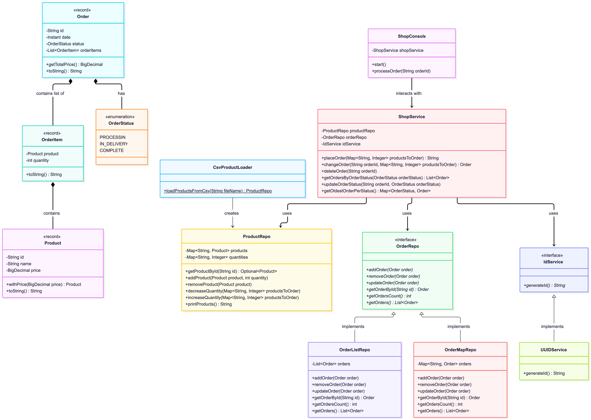
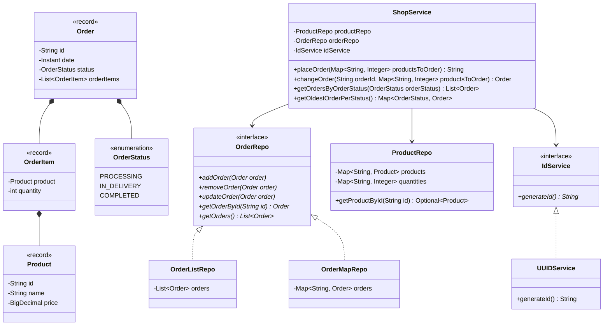

# ShopService

A Java-based e-commerce order and inventory management service built with modern Java features, clean architecture
principles, and unit testing.

---

## Features

- **Product Inventory Management**: Load products and stock quantities dynamically from CSV files. Safety with
  `Optional<Product>` to prevent null pointer exceptions.
- **Order Lifecycle Management**:
    - Place, update, and cancel orders with real-time inventory adjustments.
    - Track order statuses (`PROCESSING`, `IN_DELIVERY`, `COMPLETED`).
    - Search orders by status using Java Streams API.
    - Find the oldest active order per status (`getOldestOrderPerStatus()`).
- **Flexible Extensions**:
    - Abstract ID Generation strategy (`IdService` interface with `UUIDService` implementation) for easy mock-testing.
    - Polymorphic order persistence (`OrderListRepo` and `OrderMapRepo`).
- **Interactive CLI Console**: An ANSI-colored command-line interface for customer operations.
- **Unit Testing**: Comprehensive test coverage using **JUnit 5**.

---

## Tech Stack & Dependencies

- **Java**: 17+ (using Records, Java Streams API, `Instant`, `Optional`)
- **Lombok**: `@With`, `@Getter`, `@Data`, `@AllArgsConstructor` annotations
- **Testing**: JUnit 5, AssertJ / Standard Assertions
- **Build Tool**: Maven / Gradle

---

## Class Architecture & Diagram

Click to view Mermaid Diagram Code

